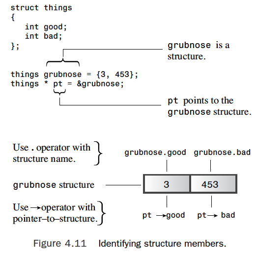
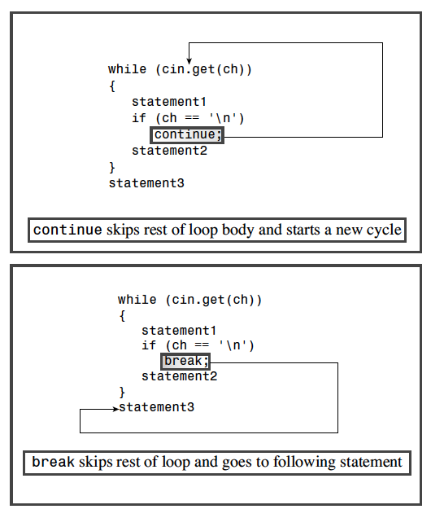

 

## Loops and relational expressions

- The Increment (++) and Decrement (--) Operators

The *prefix* version comes before the operand, as in ++x.

The *postfix* version comes after the operand, as in x++.

Roughly speaking, the notation `a++` means "use the current value of a in evaluating an expression, and then increment the value of a".

Similarly, the notation `++b` means "first increment the value of b and then use the new value in evaluating the expression."
```c++
int x = 5;
int y = ++x;        // change x, then assign to y
					// y is 6, x is 6

int z = 5;
int y = z++;		// assign to y, then change z
					// y is 5, z is 6
```

However, although the choice between prefix and postfix forms has no effect on the program's behavior, it is possible for the choice for the choice to have a small effect on execution speed. For built-in types, it most likely makes no difference which form you use. For user-defined type, the postfix version works by first stashing a copy of the value, incrementing the value, and then returning the stashed copy. Thus, for classes, the prefix version is a bit more effcient than the postfix version.

- Compound statements or Blocks

Using paired braces to construct a commpound statement, or block, the block consists of paired braces and the statements they enclose and, for the purposes of syntax, counts as a single statement.

Compound statements have another interesting property. If you define a new variable inside a block, the variable persists only as long as the program is executing statements within the block. When execution leaves the block, the variable is deallocated.
```c++
#include <iostream>
int main()
{
	using std::cout;
	using std::endl;
	int x = 20;				// original x
	{						// block starts
		cout << x << endl;	// use original x
		int x = 100;		// new x
		cout << x << endl;	// use new x
	}						// block ends
	cout << x << endl;		// use original x
	return 0;
}
```

- The comma operator

The comma operator does the same for expressions, enabling you to sneak two expressions into a place where C++ syntax allows only one expression.
```c++
++j, --i 	// two expressions count as one for syntax purposes
int i, j;	// comma is a separator here, not an operator
```

The following example uses the comma operator twice in a program that reverses the contents of a string class object.
```c++
string word;
char temp;
int i, j;
for (j = 0, i = word.size() - 1; j < i; --i, ++j)
{						// start block
	temp = word[i];
	word[i] = word[j];
	word[j] = temp;
}						// end block
```



Image Source: C++ Primer Plus (6th Edition)


- Comparing C-Style Strings

If `word` is the array name, the following test might not do what you think it should do:
```c++
word == "mate"
```

Remember that the name of an array is a synonym for its address. Similarly, a quoted string constant is a synonym for its address. Thus, the preceding relational expression doesn't test whether the strings are the same, it checks whether they are stored at the same address.

Instead, you can go to the C-style string library and use the `strcmp()` function to compare strings. You can also use them to compare characters because characters are actually integer types.

- Comparing string Class Strings

The following test condition uses a relational operator with  a string object on the left and a C-style string on the right:
```c++
word != "mate"
```

The way the string class overloads the != operator allows you to use it as long as at least one of the operands is a string object; the remaining operand can be either a string object or a C-style string.

- The Range-Based for Loop (C++11)

The C++11 adds a new form of loop called the _range-based_ for loop.
```c++
double prices[4] = {3.99, 2.99, 5.08, 1.18};
// print all the members, one per line
for (double x : prices)
    cout << x << std::endl;
// modify array values
for (double &x : prices)
    x = x * 0.80;    // 20% off sale
```

### Summary

Many programs read text input or text files character-by-character. The istream class provides several ways to do this. If ch is a type char variable, the following statement reads the next input character into ch:
```c++
cin >> ch;
```

However, it skips over spaces, newlines, and tabs. The following member function call reads the next input character, regardless of its value, and places it in ch:
```c++
cin.get(ch);
```

The member function call `cin.get()` returns the next input character, including spaces, newlines, and tabs, so it can be used as follows:
```c++
ch = cin.get();
```

The `cin.get(char)` member function call reports encountering the EOF condition by returning a value with the bool converion of false, whereas the `cin.get()` member function call reports the EOF by returning the value EOF, which is defined in the iostream file.


## Branching Statements


- The Logical OR Operator: `||`
- The Logical AND Operator: `&&`
- The Logical NOT Operator: `!`

The logical AND operator has a higher precedence than the logical OR operator.

- The conditional operator ?:
```c++
// expression1 ? expression2 : expression3
5 > 3 ? 10 : 12   // 5 > 3 is true, so expression value is 10

const char x[2] [20] = {{"Jason ","at your service\n"};
const char * y = "Quillstone ";
for (int i = 0; i < 3; i++)
    cout << ((i < 2) ? !i ? x [i] : y : x[1]);
```

- The break and continue statements

The break statement in a switch statement and in any of the loops. It causes program execution to pass to the next statement following the switch or the loop.

The continue statement is used in loops and causes a program to skip the rest of the body of the loop and then start a new loop cycle.



Image Source: C++ Primer Plus (6th Edition)

- error-handling
```c++
while (! (cin >> golf[i])) {
	cin.clear();    // reset input
	while (cin.get() != '\n')
		continue;   // get rid of bad input
	cout << "Please enter a number: ";
}
```
If the user enters `88`, the `cin` expression is true, and a value is placed in the array. the expression `!(cin >> golf[i])` is false, this loop terminates.

But if the user enters `must i?`, the `cin` expression is false, nothing is placed into the array, the program enters the inner while loop. The first statement in the loop uses the `clear()` method to reset inpt. If you omit this statement, the program refuses to read any more input.

Next, the program uses `cin.get()` in a `while` loop to read the remaining input through the end of the line. This gets rid of the bad input, along with anything else on the line. Another approach is to read to the next whitespace, which gets rid of bad input one word at a time instead of one line at a time. Finally, the program tells the user to enter a number.

- Text I/O

When you use `cin` for input, the program views input as a series of bytes, with each byte being interpreted as a character code. No matter what the destination data type, the input begins as character data - that is, text data.The `cin` object then has the responsibility of translating text to other types.

On output, the opposite translations take place. That is, integers are converted to sequences of digit characters, and floating-point numbers are converted to sequences of digits and other characters. Character data requires no translation.

## Reference

- C++ Primer Plus (Developer's Library) 6th Edition by Stephen Prata
